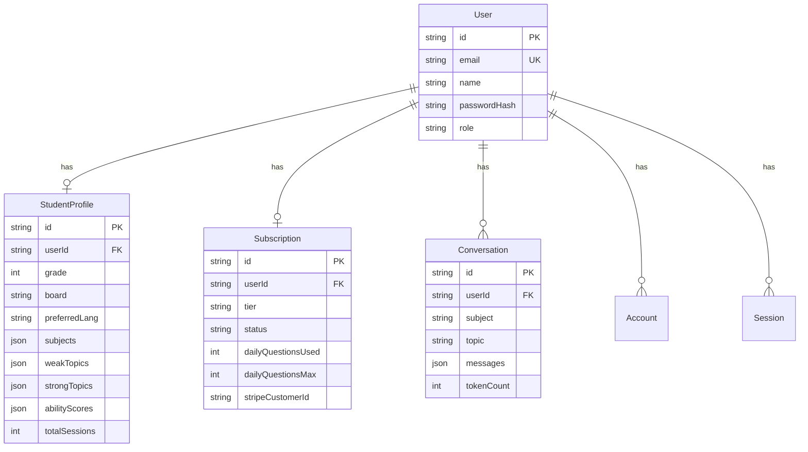

<div align="center">

# 🧠 EduBot — AI Tutor for Indian Students

**Personalized, adaptive AI tutoring for grades 6–10 across CBSE, ICSE & State boards**

[](https://nextjs.org/)
[](https://expo.dev/)
[](https://prisma.io/)
[](https://sdk.vercel.ai/)
[](https://typescriptlang.org/)

</div>

---

## 📖 Overview

EduBot is a full-stack, cross-platform AI tutor designed specifically for Indian school students in grades 6 through 10. It delivers personalized, curriculum-aligned explanations, adaptive quizzes, and progress tracking — powered by a multi-model AI pipeline that intelligently routes between **Google Gemini**, **OpenAI GPT-4o**, and **local LLMs (Ollama)**.

The application ships with a **Next.js 16 web app** and a companion **React Native (Expo) mobile app**, both backed by a shared API layer.

### ✨ Key Highlights

- **Multi-model AI pipeline** — Auto-routes through Gemini 2.5 Flash → Gemini 3.1 Flash Lite → local Ollama, with premium GPT-4o support
- **Adaptive teaching** — Adjusts explanation depth based on student ability (Beginner → Advanced bands)
- **Board-specific curriculum** — Tailored prompts and quiz generation for CBSE, ICSE & State boards
- **Web grounding** — Automatically uses Google Search for factual/history questions
- **Built-in safety** — Content moderation, PII stripping, anti-cheating detection, and distress response
- **Cross-platform** — Web + iOS/Android from a single codebase

---

## 🏗️ Architecture

```
ai_tutor_chatbot_app/
├── src/                          # Next.js web application
│   ├── app/                      # App Router pages & API routes
│   │   ├── (app)/                # Authenticated app pages
│   │   │   ├── chat/             # AI chat interface
│   │   │   ├── dashboard/        # Student dashboard
│   │   │   ├── quiz/             # Adaptive quiz engine
│   │   │   ├── progress/         # Learning progress reports
│   │   │   ├── profile/          # Student profile management
│   │   │   ├── settings/         # App settings
│   │   │   └── subscribe/        # Subscription management
│   │   ├── api/                  # Backend API routes
│   │   │   ├── ai/chat/          # AI chat endpoint (multi-model)
│   │   │   ├── ai/transcribe/    # Voice transcription
│   │   │   ├── auth/             # NextAuth.js endpoints
│   │   │   ├── conversations/    # Conversation CRUD
│   │   │   ├── profiles/         # Student profile API
│   │   │   ├── quiz/             # Quiz generation API
│   │   │   ├── subscription/     # Subscription management
│   │   │   ├── signup/           # User registration
│   │   │   └── webhook/          # Stripe webhooks
│   │   ├── login/                # Login page
│   │   ├── signup/               # Signup page
│   │   └── onboarding/           # Student onboarding flow
│   ├── lib/                      # Core logic & utilities
│   │   ├── ai/                   # AI pipeline modules
│   │   │   ├── prompt-builder.ts # Adaptive system prompts
│   │   │   ├── retrieval.ts      # Conversation context & web grounding
│   │   │   ├── quiz-generator.ts # Adaptive quiz generation
│   │   │   ├── safety-filter.ts  # Content safety & PII protection
│   │   │   └── ability-scorer.ts # Student ability scoring
│   │   ├── auth.ts               # NextAuth configuration
│   │   ├── llm.ts                # Multi-model LLM configuration
│   │   ├── prisma.ts             # Database client
│   │   └── ...                   # Rate limiting, progress, utilities
│   ├── components/               # React UI components
│   ├── hooks/                    # Custom React hooks
│   └── types/                    # TypeScript type definitions
├── mobile/                       # React Native (Expo) mobile app
│   ├── src/
│   │   ├── screens/              # Mobile screens (Chat, Login)
│   │   ├── lib/                  # Mobile utilities
│   │   └── providers/            # Context providers
│   └── App.tsx                   # Mobile app entry point
├── prisma/
│   └── schema.prisma             # Database schema
└── package.json
```

---

## 🚀 Tech Stack

| Layer | Technology | Purpose |
|-------|-----------|---------|
| **Frontend (Web)** | Next.js 16, React 19 | App Router, server components, SSR |
| **Frontend (Mobile)** | Expo 54, React Native 0.81 | Cross-platform iOS & Android app |
| **AI Models** | Gemini 2.5 Flash, GPT-4o, Ollama | Multi-model AI with automatic fallback |
| **AI SDK** | Vercel AI SDK v6 | Streaming, tool use, model abstraction |
| **Authentication** | NextAuth v5 (Auth.js) | Credentials-based auth with JWT sessions |
| **Database** | SQLite via Prisma 7 + libSQL | Lightweight relational storage |
| **Payments** | Stripe (integration ready) | Subscription billing |
| **Styling** | Vanilla CSS | Custom design system with glassmorphism |
| **Language** | TypeScript 5 | Full type safety across the stack |

---

## 🤖 AI Pipeline

EduBot's AI pipeline is the core of the application, handling model selection, context retrieval, safety checks, and response generation.

### Model Routing Strategy

```
User Request
    │
    ├── "premium" mode ──► OpenAI GPT-4o (streaming)
    │
    └── "auto" mode (default)
         │
         ├── Factual/history question? ──► Gemini + Google Search (grounded)
         │
         ├── Try Gemini 2.5 Flash
         │     └── Rate limited? ──► Try Gemini 3.1 Flash Lite
         │                              └── Also limited? ──► Ollama (local fallback)
         │
         └── All providers failed? ──► Emergency Gemini summary fallback
```

### Adaptive Prompting

The system dynamically adjusts teaching style based on student ability scores:

| Ability Band | Score Range | Teaching Approach |
|-------------|-------------|-------------------|
| **Beginner** | 0–39 | Micro-steps, visual analogies, simplified vocabulary |
| **Developing** | 40–64 | Worked examples, highlight common mistake areas |
| **Proficient** | 65–84 | Skip basics, use proper terminology, focused answers |
| **Advanced** | 85–100 | Socratic method, cross-topic connections, depth over breadth |

### Conversation Intelligence

- **Context-aware retrieval** — Selects the most relevant past messages using keyword overlap + recency scoring
- **Follow-up detection** — Automatically includes conversation history for follow-up questions
- **Conversation summaries** — Auto-generates rolling summaries for long conversations
- **Standalone detection** — Identifies fact-lookup queries that don't need conversation context

### Safety & Privacy

- **Content moderation** — Blocks harmful, explicit, and off-topic content with appropriate redirection
- **Distress detection** — Detects signs of emotional distress and responds with empathetic support resources
- **Anti-cheating** — Redirects homework/exam cheating requests toward understanding-based learning
- **PII stripping** — Removes email addresses, phone numbers, and Aadhaar numbers before sending to LLMs
- **Web search grounding** — Sanitizes citations from grounded responses

---

## 📊 Data Model



### Subscription Tiers

| Feature | Free | Basic | Pro |
|---------|------|-------|-----|
| Daily questions | 10 | 50 | Unlimited |
| Subjects | Mathematics | All 5 | All 5 |
| Input modes | Text | Text, Voice | Text, Voice, Image |

---

## ⚡ Getting Started

### Prerequisites

- **Node.js** 20+ and **npm**
- (Optional) **Ollama** for local LLM support — [install here](https://ollama.com)
- (Optional) **Expo CLI** for mobile development

### 1. Clone & Install

```bash
git clone https://github.com/vipulconda/ai-tutor-chatbot-app.git
cd ai-tutor-chatbot-app
npm install
```

### 2. Configure Environment

Copy the `.env` file and fill in your API keys:

```bash
cp .env .env.local
```

```env
# Required — Database
DATABASE_URL="file:./dev.db"

# Required — Auth
AUTH_SECRET="your-secret-at-least-32-characters-long"
NEXTAUTH_URL="http://localhost:3000"

# Required — At least one AI provider:

# Google Gemini (recommended — free tier available)
GOOGLE_GENERATIVE_AI_API_KEY="your-gemini-api-key"

# OpenAI (optional — for premium mode)
OPENAI_API_KEY="sk-your-openai-api-key"

# Local LLM via Ollama (optional)
LOCAL_LLM_ENABLED="true"
LOCAL_LLM_BASE_URL="http://127.0.0.1:11434/v1"
LOCAL_LLM_API_KEY="ollama"
LOCAL_LLM_MODEL="qwen2.5:7b-instruct"

# Stripe (optional — for subscriptions)
STRIPE_SECRET_KEY="sk_test_..."
STRIPE_PUBLISHABLE_KEY="pk_test_..."
STRIPE_WEBHOOK_SECRET="whsec_..."
```

### 3. Set Up the Database

```bash
npx prisma generate
npx prisma db push
```

### 4. Run the Development Server

```bash
npm run dev
```

Open [http://localhost:3000](http://localhost:3000) to see the app.

### 5. (Optional) Run the Mobile App

```bash
cd mobile
npm install
npx expo start
```

Scan the QR code with **Expo Go** on your phone, or press `i` for iOS simulator / `a` for Android emulator.

### 6. (Optional) Set Up Local LLM

```bash
# Install Ollama
brew install ollama    # macOS

# Pull a model
ollama pull qwen2.5:7b-instruct

# Ollama runs automatically in the background
```

---

## 📱 Supported Platforms

| Platform | Status | Technology |
|----------|--------|-----------|
| 🌐 Web | ✅ Production ready | Next.js 16 (App Router) |
| 📱 iOS | ✅ Functional | Expo + React Native |
| 🤖 Android | ✅ Functional | Expo + React Native |

---

## 🧪 API Reference

### Chat — `POST /api/ai/chat`

Primary AI tutoring endpoint with multi-model routing and streaming support.

**Request body:**

```json
{
  "message": "What is photosynthesis?",
  "subject": "Science",
  "topic": "Biology",
  "conversationId": "optional-existing-id",
  "modelPreference": "auto",
  "imageBase64": "data:image/png;base64,..."
}
```

**Response variants:**

```jsonc
// Standard response
{ "assistantResponse": "Photosynthesis is..." }

// Grounded response (with web search)
{ "groundedResponse": "...", "sources": [{ "title": "...", "url": "..." }] }

// Safety response
{ "safetyResponse": "I'm here to help with your school subjects..." }

// Streaming (premium/specific model modes)
// Returns text/event-stream with X-Conversation-Id header
```

### Quiz — `POST /api/quiz`

Generate adaptive quizzes based on student ability and curriculum.

### Conversations — `GET /api/conversations`

List and manage student conversation history.

### Profile — `GET/PUT /api/profiles`

Read and update student academic profiles.

### Subscription — `GET/POST /api/subscription`

Manage subscription tiers and daily usage quotas.

---

## 🛠️ Development

### Available Scripts

```bash
npm run dev          # Start Next.js dev server
npm run build        # Production build
npm run start        # Start production server
npm run lint         # Run ESLint
npm run dev:mobile   # Start Expo mobile dev server
```

### Project Conventions

- **TypeScript** — Strict mode, no `any` types without explicit justification
- **App Router** — All pages use Next.js 16 App Router conventions
- **Server Components** — Default to RSC; use `"use client"` only when needed
- **Database** — SQLite for development; JSON-serialized fields for flexible data

### Key Environment Variables

| Variable | Required | Description |
|----------|----------|-------------|
| `DATABASE_URL` | ✅ | SQLite database file path |
| `AUTH_SECRET` | ✅ | NextAuth session encryption key |
| `GOOGLE_GENERATIVE_AI_API_KEY` | ✅ | Google Gemini API key |
| `OPENAI_API_KEY` | ❌ | OpenAI key for premium mode |
| `LOCAL_LLM_ENABLED` | ❌ | Enable local Ollama fallback |
| `LOCAL_LLM_MODEL` | ❌ | Ollama model name |
| `STRIPE_SECRET_KEY` | ❌ | Stripe billing integration |

---

## 📐 Design Decisions

### Why Multi-Model?

EduBot uses a cascading model strategy to maximize availability and minimize cost:

1. **Gemini 2.5 Flash** — Primary model; fast, free-tier friendly, supports Google Search grounding
2. **Gemini 3.1 Flash Lite** — Fallback when the primary is rate-limited
3. **Local Ollama** — Offline fallback for complete independence from cloud APIs
4. **GPT-4o** — Premium option for users who want higher-quality responses
5. **Emergency summary** — Last-resort Gemini call with minimal context if all paths fail

### Why SQLite?

SQLite with Prisma + libSQL provides zero-configuration persistence that's ideal for development and small-scale deployments. The schema can be trivially migrated to PostgreSQL for production.

### Why JSON Fields?

Student profiles store arrays (subjects, topics) and maps (ability scores) as JSON strings in SQLite. This avoids complex join tables while keeping the schema flexible for iterative development.

---

## 🤝 Contributing

1. Fork the repository
2. Create a feature branch: `git checkout -b feature/my-feature`
3. Commit your changes: `git commit -m 'Add my feature'`
4. Push to the branch: `git push origin feature/my-feature`
5. Open a Pull Request

---

## 📄 License

This project is private and not currently licensed for public distribution.

---

<div align="center">

**Built with ❤️ for Indian students**

🧠 EduBot — Making quality education accessible through AI

</div>
